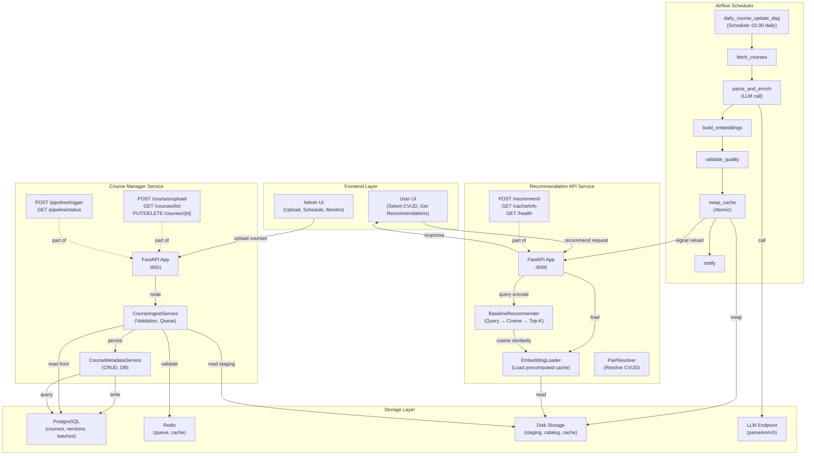
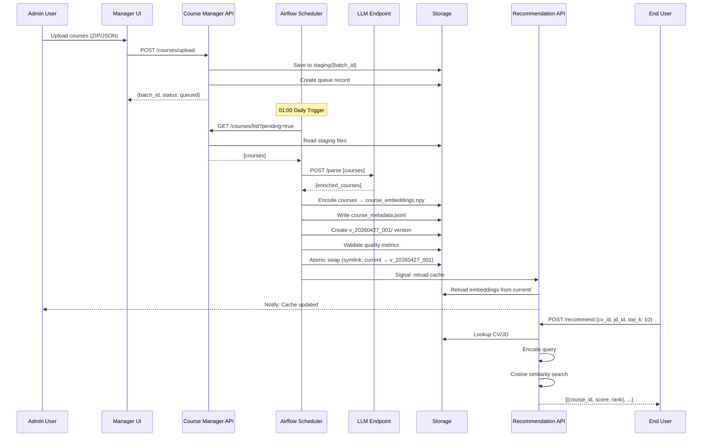
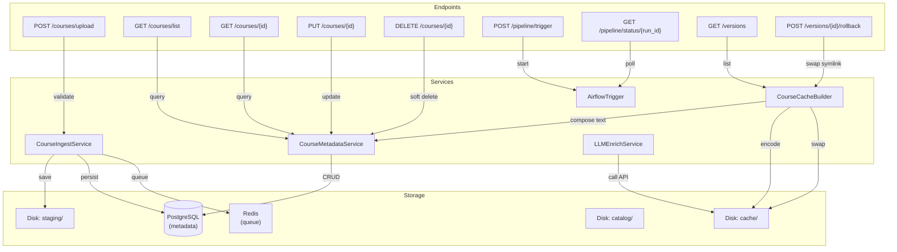
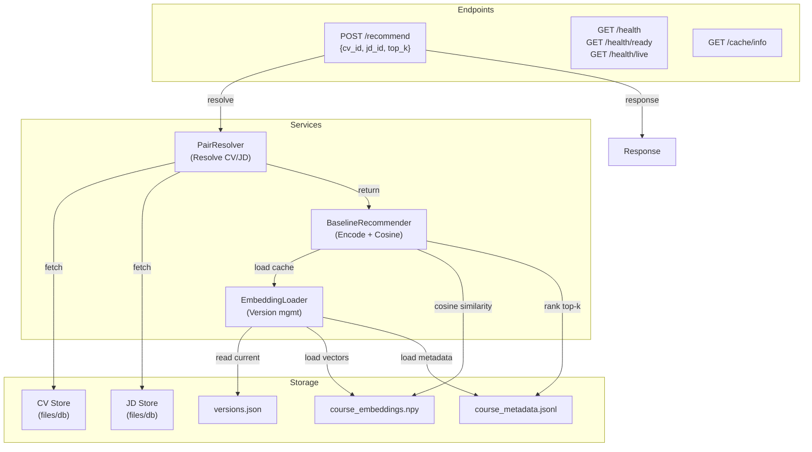
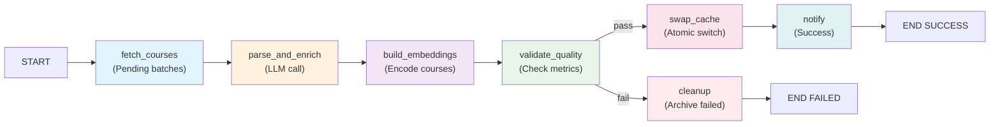
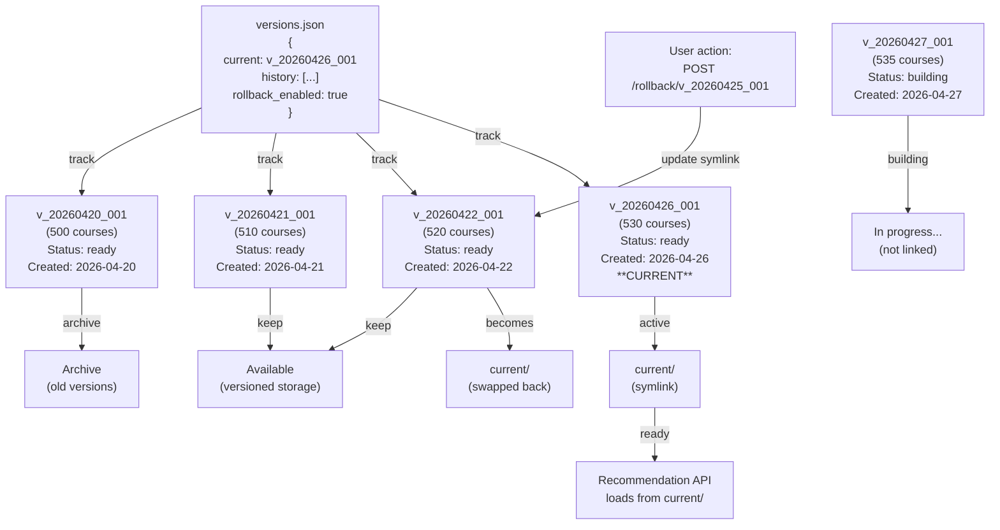
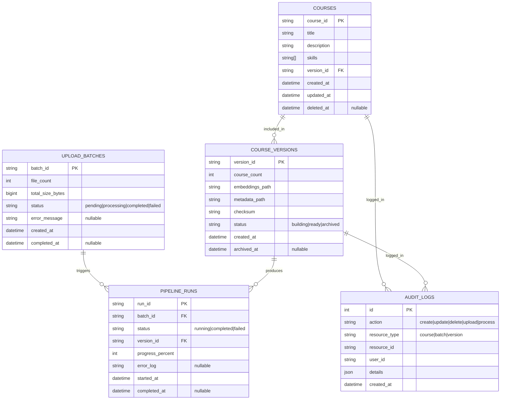
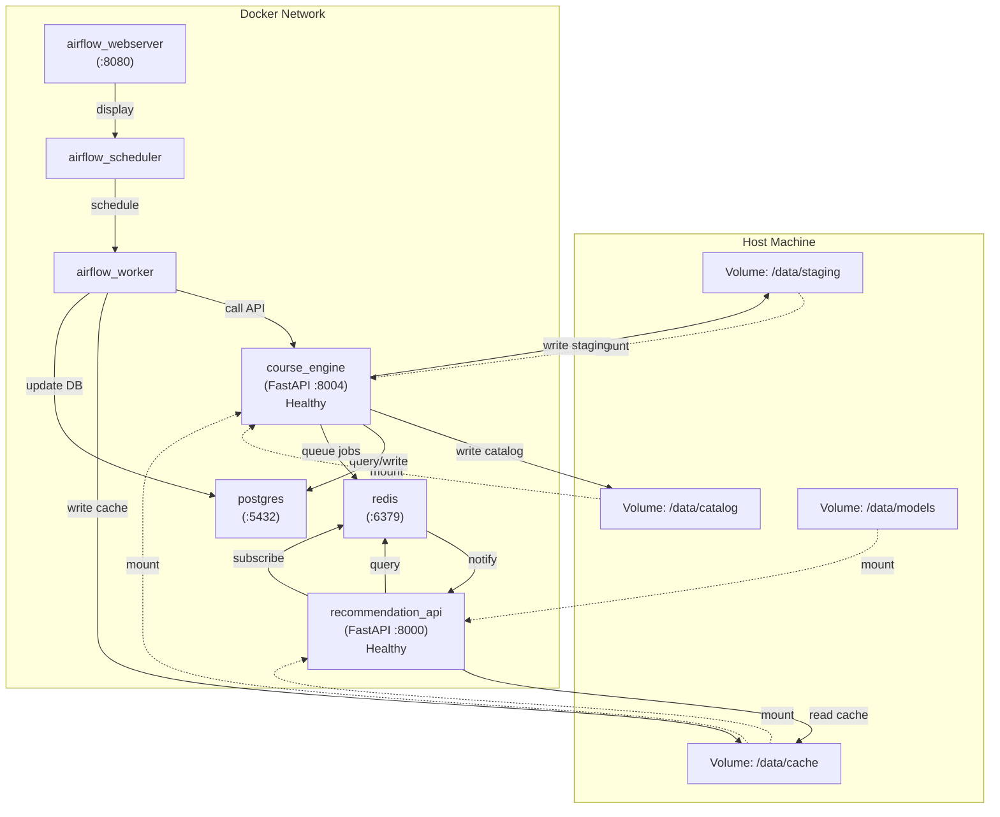

# Refactor Architecture Diagrams

## 1. High-level System Architecture (Post-Refactor)

## 2. Data Flow: Upload → Cache → Recommend

## 3. Course Manager Service Detail

## 4. Recommendation API Service Detail

## 5. Airflow DAG Pipeline

## 6. Cache Versioning & Rollback

## 7. Data Model Relationships

## 8. Deployment Topology (Docker Compose)

---

## Kết luận

Các diagrams này cho phép bạn:
1. **Hiểu rõ hệ thống sau refactor** (2 services rạch ròi)
2. **Theo dõi data flow** (upload → airflow → cache → recommend)
3. **Biết cách components kết nối** (services, storage, external systems)
4. **Lên kế hoạch deployment** (Docker, volumes, networking)
5. **Hỗ trợ communication** với team/stakeholders

Combine những diagrams này với [refactor_plan_detailed.md](refactor_plan_detailed.md) và [refactor_checklist.md](refactor_checklist.md) để có đầy đủ hướng dẫn triển khai.
